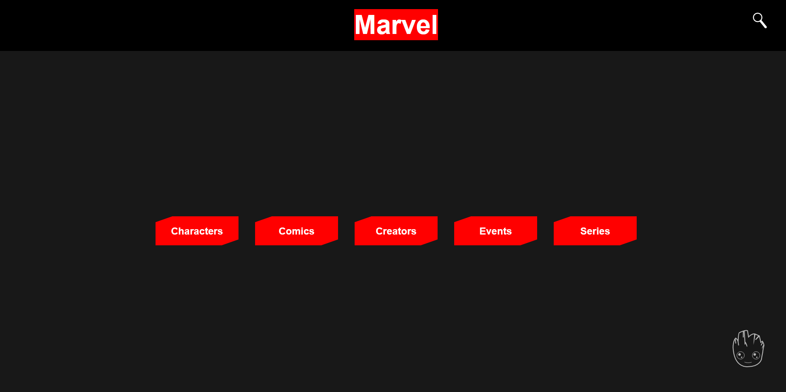

# Marvel Challenge

challenge to consume marvel api with typescript and Next Js.

   

## SUMÁRIO

- Status
- Features
- Application Demo
- Prerequisites to Run the Application
- How to Run the Application
- Tecnologias Utilizadas
- Author

## Status

✨Ready for presentation ✨

## Features

- Pagination with all characters, comics, events, creators and stories
- Search for characters
- Reponsive WebSite
- 404 Page

## Application Demo

### Marvel Desktop




### Marvel Mobile


## Prerequisites to Run the Application

You need to have Node installed on your machine.

## How to Run the Application

First, run the development server:

```bash
npm run dev
# or
yarn dev
```

Open [http://localhost:3000](http://localhost:3000) with your browser to see the result.

## Tecnologias Utilizadas

- [Typescript](https://www.typescriptlang.org/docs/handbook/typescript-in-5-minutes.html)
- [Styled-components](https://styled-components.com/docs)
- [Next Js](https://nextjs.org/docs/getting-started)

## Author


Made By Vitor Mateus

[](https://www.instagram.com/vitor_dev_/) [](https://www.linkedin.com/in/vitor-mateus-2a42461a2/)
